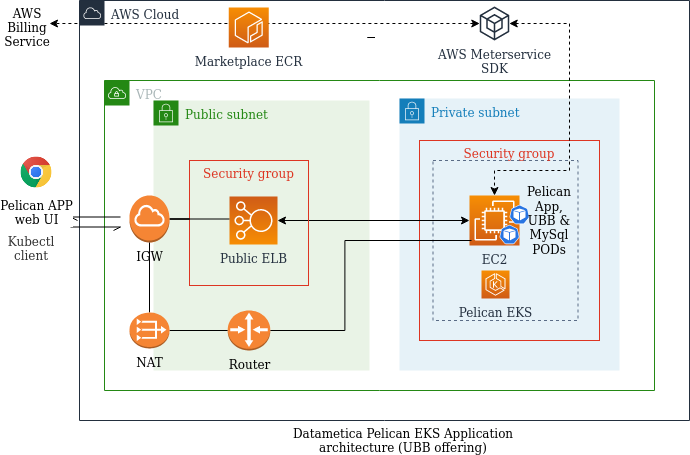

## **Pelican offering with usage based metering (pay-as-you-go)

### EKS Deployment architecture
In the case of UBB (Usage Based Billing) - the custom metered billing is applicable in the 'pay as you go model' - billed by AWS monthly. 



## **Prerequisites**

Make sure you have installed the latest version of [AWS CLI](https://aws.amazon.com/cli/), [Docker](https://docs.docker.com/get-docker) & [Helm3](https://helm.sh/)

**For linux systems, use the aws CLI:**

**Pelican Application images**

Following are the latest Pelican Images available at marketplace registry:

- [709825985650.dkr.ecr.us-east-1.amazonaws.com/datametica/pelican-ubb/pelican-web:2.0.1](http://709825985650.dkr.ecr.us-east-1.amazonaws.com/datametica/pelican-ubb/pelican-web:2.0.1)
- [709825985650.dkr.ecr.us-east-1.amazonaws.com/datametica/pelican-ubb/pelican-ubb:1.0.2](http://709825985650.dkr.ecr.us-east-1.amazonaws.com/datametica/pelican-ubb/pelican-ubb:1.0.2)
- [709825985650.dkr.ecr.us-east-1.amazonaws.com/datametica/pelican-ubb/pelican-db:5.7](http://709825985650.dkr.ecr.us-east-1.amazonaws.com/datametica/pelican-ubb/pelican-db:5.7)

##
### Steps to deploy pelican on EKS
**Create a new EKS cluster :**

Creation of an EKS cluster can be simplified using eksctl commands (document URL :  https://eksctl.io/ ).

If you choose to use a separate EKS environment solely to host the pelican, then it is recommended that you create a *private nodegroup* in your EKS cluster and use a NAT gateway for communication.

**Note** : You will have to create an EC2 Keypair if SSH access is desired for the nodes. Ref: [EC2 key pairs](https://docs.aws.amazon.com/AWSEC2/latest/UserGuide/ec2-key-pairs.html)

```
eksctl create cluster --name pelican-cluster \
  --region us-east-1 \
  --zones us-east-1a,us-east-1b \
  --nodegroup-name private-ng1 \
  --nodes 1 \
  --ssh-public-key <EC2keypair> \
  --node-private-networking \
  --vpc-nat-mode HighlyAvailable
```

**Note**: Use following cluster create command to create private EKS cluster in existing VPC. Replace <subnetid-1> <subnetid-2>.. with the already provisioned subnet-ids to which you like to launch this EKS cluster.

```
eksctl create cluster --name pelican-cluster \
  --vpc-private-subnets=<subnetid-1>,<subnetid-2>
  --nodegroup-name private-ng1 \
  --nodes 1 \
  --node-type t3.large \
  --node-volume-size 80
  --ssh-public-key <EC2keypair> \
  --node-private-networking \
  --vpc-nat-mode HighlyAvailable
```

**Step 1** : Configure Your EKS cluster

Pelican can easily be launched into an existing EKS environment or you can [spin up a new one](https://github.com/aquasecurity/marketplaces/blob/5.3/aws/docs/eks/pages/aqua-in-a-box.md#create-a-new-EKS-cluster). using [<https://eksctl.io/>].

Configure the kubeconfig file for your EKS cluster on your local machine.

```
eksctl utils write-kubeconfig --cluster=<name>

optional: [--kubeconfig=<path>][--profile=<profile>][--set-kubeconfig-context=<bool>]
```

Verify the node status

```
Kubectl get nodes
```

##
**Step 2** : Create a Service account with EKS IAM permissions

This command helps you set up the required IAM permissions required by Pelican Platform to run smoothly on Amazon EKS.

```
eksctl utils associate-iam-oidc-provider --cluster=<clustername> --approve [--profile=<profile>]
```

```
eksctl create iamserviceaccount --name pelican \
   --namespace default \
   --cluster <clustername> \
   --attach-policy-arn arn:aws:iam::aws:policy/AWSMarketplaceMeteringRegisterUsage \
   --approve

optional: [--profile <profile>]
```

##
**Step 3** : Install the Pelican Helm chart (Choose below option as per the offer you opted for)

*For parameters description please refer the [section below](#common-configuration-overrides)*

*release-name: is an instance of pelican chart running in a k8s(eks) cluster. You may can provide
a meaningful name like your org initials and pelican e.g. dm-pelican*

###
**Prerequisites**

Please download the [AWSMarkeplace repository zip](https://github.com/datametica/AWSMarketplace/archive/refs/heads/master.zip).
Extract the zip and change directory to AWSMarketplace/pelican.

OR

If you have git installed on your system then you can simply clone the repo as shown in below step

```
git clone https://github.com/datametica/AWSMarketplace.git
cd AWSMarketplace/pelican
```

Enter into *pelican* directory and run the following *helm install* command.
Make sure the *charts/pelican-ubb-chart* path should be accessible.

###
**Helm install command fot pelican-ubb**

```
helm install \
      --set-string secrets.awsAccessKeyId=<aws access key id> \
      --set-string secrets.awsSecretAccessKey=<aws secret key id> \
      --set-string secrets.awsIamRole=<role arn> \
      --set-string aws_region=<eks cluster region> \ 
      --set-string pelican.service.loadBalancerSourceRanges=<ip-range> \
      --set-string pelicandb.password=<password> \
      --set-string pelicandb.image.repo=<pelicandb-image-uri> \
      --set-string pelicandb.image.tag=<pelicandb-image-tag> \
      --set-string pelican.image.repo=<pelican-image-uri> \
      --set-string pelican.image.tag=<pelican-image-tag> \
      --set-string ubb.image.repo=<pelicanubb-image-uri> \
      --set-string ubb.image.tag=<pelicanubb-image-tag> <release-name> charts/pelican-ubb-chart/

Example: Deploy pelican-ubb with latest images
```
helm install \
      --set-string secrets.awsAccessKeyId=<aws access key id> \
      --set-string secrets.awsSecretAccessKey=<aws secret key id> \
      --set-string secrets.awsIamRole=<role arn> \
      --set-string aws_region=<eks cluster region> \
      --set-string pelican.service.loadBalancerSourceRanges=0.0.0.0/0 \
      --set-string pelicandb.password='DbRoot@312!' \
      --set-string pelicandb.image.repo='709825985650.dkr.ecr.us-east-1.amazonaws.com/datametica/pelican-ubb/pelican-db' \
      --set-string pelicandb.image.tag=5.7 \
      --set-string pelican.image.repo=709825985650.dkr.ecr.us-east-1.amazonaws.com/datametica/pelican-ubb/pelican-web \
      --set-string pelican.image.tag=2.0.1 \
      --set-string ubb.image.repo=709825985650.dkr.ecr.us-east-1.amazonaws.com/datametica/pelican-ubb/pelican-ubb \
      --set-string ubb.image.tag=1.0.2 dm-pelican charts/pelican-ubb-chart/
```

*Please note: use valid values for aws access and secret key ids, region and role-arn. role-arn is optional.*


##
**Step 4** : Launch Pelican console

Obtain the Pelican console URL by running the following command.
```
kubectl get svc
```

After running the above command, you will get the LoadBalancer IP address and port number to launch the Pelican application from a web browser with appropriate network configurations (in case of VPN).

## Common configuration overrides
efer to the `values.yaml` file for a full list of available values to override; some common keys are listed here:

| Key                                          | Default value                                 | Description                                                                                                                                                                                                                                                                 |
| -------------------------------------------- | --------------------------------------------- | --------------------------------------------------------------------------------------------------------------------------------------------------------------------------------------------------------------------------------------------------------------------------- |
| `pelican.service.loadBalancerSourceRanges`   | 0.0.0.0/0                                     |  Restricts traffic through the load balancer to the IPs specified in this field. Provide comma separated CIRDs  |
| `pelicandb.password`                         | None                                          | The Pelican DB (MySql) pelican user password.                   |
| `pelicandb.image.repo`                       | None                                          | The Pelican DB docker image repository path.                    |
| `pelicandb.image.tag`                        | None                                          | The Pelican DB docker image tag.                                |
| `pelican.image.repo`                         | None                                          | The Pelican docker image repositiry path.                       |
| `pelican.image.tag`                          | None                                          | The Pelican docker image tag.                                   |
| `ubb.image.repo`                             | None                                          | The Pelican UBB agent image repository path.                    |
| `ubb.image.tag`                              | None                                          | The Pelican UBB agent image tag.                                |
| `pelican.service.port`                       | 8080                                          | The Pelican web service port number.                            |
| `pelicandb.port`                             | None                                          | The Pelican DB service port number.                             |

</tbody>
</table>

