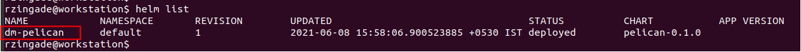
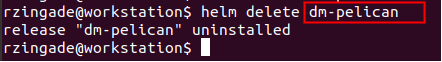
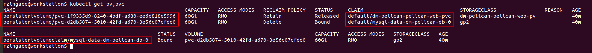
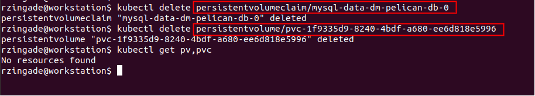

# Uninstall pelican from EKS

To uninstall the pelican from EKS execute the following steps

### Run helm list command to get the release name
```
  $ helm list
```

*note down the pelican release name that you wish to delete*

### Uninstall the helm release
```
  $ helm delete <pelican release name>
```


### List the associated persistent volume and persistent volume claims
```
  $ kubectl get pv,pvc
```


### Remove the persistent volume and persistent volume claims
```
  $ kubectl delete persistentvolumeclaim/mysql-data-<release-name>-db-0
  $ kubectl delete persistentvolume/<pv with claimref as pelican-web>
```

