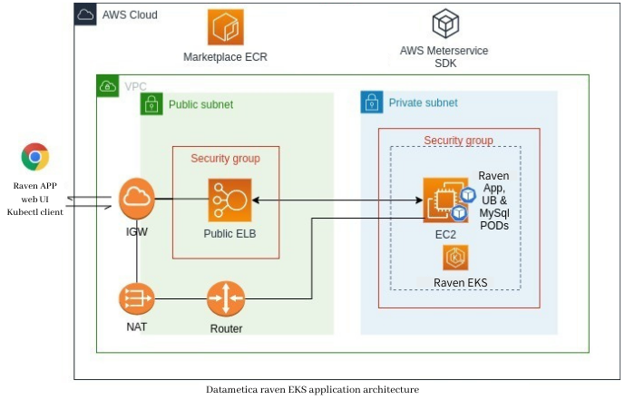

## **Raven with metered billing on AWS marketplace**

## ** Note: This is no longer supported. Please refer to raven/byol option. Thanks

### Overview
Datametica intends to bring its suite of products starting with the Raven query translation and validation product to the cloud marketplace. We have implemented support to launch and use Raven over Kubernetes and can be integrated with AWS's EKS as a Kubernetes app with the marketplace.

### EKS Deployment architecture
Raven can be deployed using helm charts on EKS, the deployment architecture will look like as below



Raven on EKS accelerates the data translation process between source and destination data bases and performs automated data validations (for redshift). For data persistence the application will sync the translated job details data with PDs.
Kubernetes manages Raven single-instance solutions and the Raven UI endpoints by default exposed externally using a LoadBalancer Service on a single port 8080 or 8443 - for HTTP and HTTPS interface.

The sizing and configuration can be customized and managed using ConfigMaps and Helm chart values.yml

The Raven EKS version adapts a custom pricing model and strategy is charged by datametica, billed by AWS. Here we have integrated the usage based billing agent as a side-car container with Raven app for usage metering.

**Prerequisites**
 
Make sure you have installed the latest version of [AWS CLI](https://aws.amazon.com/cli/), [Docker](https://docs.docker.com/get-docker) & [Helm3](https://helm.sh/)
 
**For linux systems, use the aws CLI:**
  
**Raven Application images**
Following are the latest Raven Images available at marketplace registry:

- [709825985650.dkr.ecr.us-east-1.amazonaws.com/datametica/raven-ubb/raven-web1:2.0.2](http://709825985650.dkr.ecr.us-east-1.amazonaws.com/datametica/raven-ubb/raven-web1:2.0.2)
- [709825985650.dkr.ecr.us-east-1.amazonaws.com/datametica/raven-ubb/raven-ubb:1.0.1](http://709825985650.dkr.ecr.us-east-1.amazonaws.com/datametica/raven-ubb/raven-ubb:1.0.1)
- [709825985650.dkr.ecr.us-east-1.amazonaws.com/datametica/raven-ubb/raven-db:9.6](http://709825985650.dkr.ecr.us-east-1.amazonaws.com/datametica/raven-ubb/raven-db:9.6)

##
### Appendix
**Create a new EKS cluster :**

Creation of an EKS cluster can be simplified using eksctl commands (document URL :  https://eksctl.io/ ).

If you choose to use a separate EKS environment solely to host the raven, then it is recommended that you create a *private nodegroup* in your EKS cluster and use a NAT gateway for communication.

**Note** : You will have to create an EC2 Keypair if SSH access is desired for the nodes.

```
eksctl create cluster --name raven-cluster \
    --region us-east-1 \
    --zones us-east-1a,us-east-1b \
    --nodegroup-name private-ng1 \
    --nodes 1 --ssh-public-key <EC2keypair> \
    --node-private-networking \
    --vpc-nat-mode HighlyAvailable
```

**Note**: Use following cluster create command to create private EKS cluster in existing VPC. Replace <subnetid-1> <subnetid-2>.. with the already provisioned subnet-ids to which you like to launch this EKS cluster.

```
eksctl create cluster --name raven-cluster \
  --vpc-private-subnets=<subnetid-1>,<subnetid-2>
  --nodegroup-name private-ng1 \
  --nodes 1 \
  --node-type t3.large \
  --node-volume-size 80
  --ssh-public-key <EC2keypair> \
  --node-private-networking \
  --vpc-nat-mode HighlyAvailable
```

**Step 1** : Configure Your EKS cluster

Raven can easily be launched into an existing EKS environment or you can [spin up a new one](https://github.com/aquasecurity/marketplaces/blob/5.3/aws/docs/eks/pages/aqua-in-a-box.md#create-a-new-EKS-cluster). using [<https://eksctl.io/>].

Configure the kubeconfig file for your EKS cluster on your local machine.

```
eksctl utils write-kubeconfig --cluster=<name> 

optional: [--kubeconfig=<path>][--profile=<profile>][--set-kubeconfig-context=<bool>]
```

Verify the node status

```
Kubectl get nodes
```

##
**Step 2** : Create a Service account with EKS IAM permissions

This command helps you set up the required IAM permissions required by raven Platform to run smoothly on Amazon EKS.

```
eksctl utils associate-iam-oidc-provider \
  --cluster=<cluster_name> \ 
  --approve 

optional: [--profile=<profile>]
```

```
eksctl create iamserviceaccount \
  --name raven \
  --namespace default \
  --cluster <cluster_name> \
  --attach-policy-arn arn:aws:iam::aws:policy/AWSMarketplaceMeteringRegisterUsage \
  --approve 

optional: [--profile <profile>]
```

##
**Step 3** : Install the Raven Helm chart:

*For parameters description please refer the [section below](#common-configuration-overrides)*

*release-name: is an instance of raven chart running in a k8s(eks) cluster. You may can provide
a meaningful name like your org initials and raven e.g. dm-raven*

###
**Prerequisites**

Please download the [AWSMarkeplace repository zip](https://github.com/datametica/AWSMarketplace/archive/refs/heads/master.zip).
Extract the zip and change directory to AWSMarketplace/raven.

OR

If you have git installed on your system then you can simply clone the repo as shown in below step

```
git clone https://github.com/datametica/AWSMarketplace.git
cd AWSMarketplace/raven
```

Enter into *raven* directory and run the following *helm install* command.
Make sure the *charts* directory path should be accessible.


```
helm install --set-string raven.service.loadBalancerSourceRanges=<ip-range> \
  --set-string ravendb.password=<password> \
  --set-string ravendb.image.repo=<ravendb-image-uri> \
  --set-string ravendb.image.tag=<ravendb-image-tag> \
  --set-string raven.image.repo=<raven-image-uri> \
  --set-string raven.image.tag=<raven-image-tag> \
  --set-string ubb.image.repo=<ravenubb-image-uri> \
  --set-string ubb.image.tag=<ravenubb-image-tag> <release-name> <chart-path>
```

Example: Deploy raven with latest images
```
helm install --set-string ra+ven.service.loadBalancerSourceRanges=0.0.0.0/0 \
  --set-string ravendb.password='DbRoot@312!' \
  --set-string ravendb.image.repo=709825985650.dkr.ecr.us-east-1.amazonaws.com/datametica/raven-ubb/raven-db \
  --set-string ravendb.image.tag=9.6 \
  --set-string raven.image.repo=709825985650.dkr.ecr.us-east-1.amazonaws.com/datametica/raven-ubb/raven-web1 \
  --set-string raven.image.tag=2.0.2 \
  --set-string ubb.image.repo=709825985650.dkr.ecr.us-east-1.amazonaws.com/datametica/raven-ubb/raven-ubb \
  --set-string ubb.image.tag=1.0.1 dmm-raven charts

```

*Please Note: The loadBalancerSourceRanges CIDR provided in the example 0.0.0.0/0 makes the raven web service open to everyone.
As a best practice you should be replacing this CIDR value to your own networks public CIDR or subnet ranges. You can find this 
CIDR value from your VPN gateway or consult your network admin.*

##
**Step 4** : Launch Raven console

Obtain the raven console URL by running the following command.

```
kubectl get svc
```

After running the above command, you will get the LoadBalancer IP address and port number to launch the  application from a web browser with appropriate network configurations (in case of VPN).

## Common configuration overrides
Refer to the `values.yaml` file for a full list of available values to override; some common keys are listed here:

| Key                                          | Default value                                 | Description                                                                                                                                                                                                                                                                 |
| -------------------------------------------- | --------------------------------------------- | --------------------------------------------------------------------------------------------------------------------------------------------------------------------------------------------------------------------------------------------------------------------------- |
| `raven.service.loadBalancerSourceRanges`   | 0.0.0.0/0                                     |  Restricts traffic through the load balancer to the IPs specified in this field. Provide comma separated CIRDs  |
| `ravendb.password`                         | None                                          | The Raven DB (pgsql) raven user password.                   |
| `ravendb.image.repo`                       | None                                          | The Raven DB docker image repository path.                    |
| `ravendb.image.tag`                        | None                                          | The Raven DB docker image tag.                                |
| `raven.image.repo`                         | None                                          | The Raven docker image repositiry path.                       |
| `raven.image.tag`                          | None                                          | The Raven docker image tag.                                   |
| `ubb.image.repo`                           | None                                          | The Raven UBB agent image repository path.                    |
| `ubb.image.tag`                            | None                                          | The Raven UBB agent image tag.                                |
| `raven.service.port`                       | 8443                                          | The Raven web service port number.                            |
| `ravendb.port`                             | 3306                                          | The Raven DB service port number.                             |

</tbody>
</table>

